# python-challenge-4 "Pong" Game
creating a python "Pong" game 

## Step-by-Step Approach

1. I create a pong game using the Python library `turtle`

2. Create a window screen by assigning a variable to `turtle.Screen()`

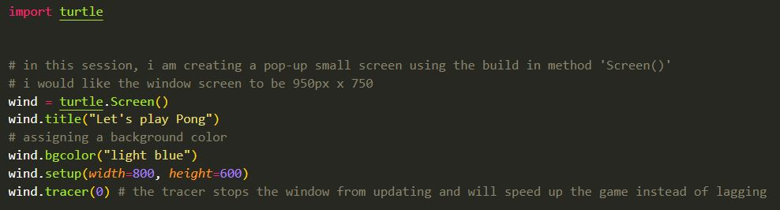

3. I made the background light blue and the paddle navy color and the ball yellow and aligned in the center but decided to change the ball to orange at the end.

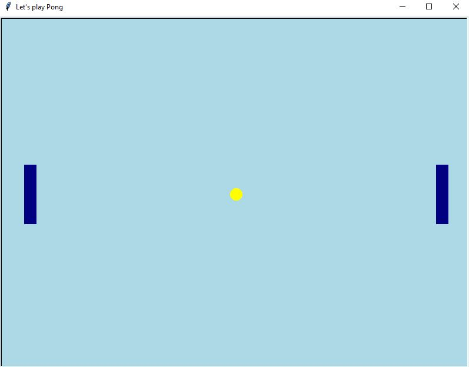

4. To make the paddle moving up and down, I created 4 function calls `left_pad_mov_down` and `right_pad_mov_up` using the `w` key and `s` key for the left side and `Up` key and `Down` key for the right side.

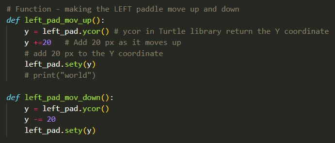
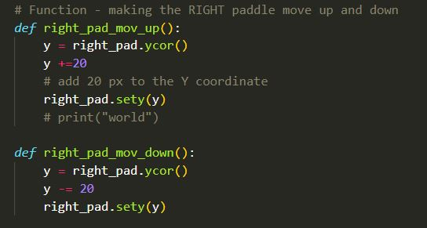

5. I created a keyboard binding by using the python `listen()` method and `onkeypress ()` method. The `listen()` allows the computer to listen when the `w` or `s` or `Up` or `Down` keys are pressed by the user.

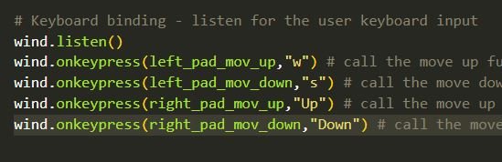
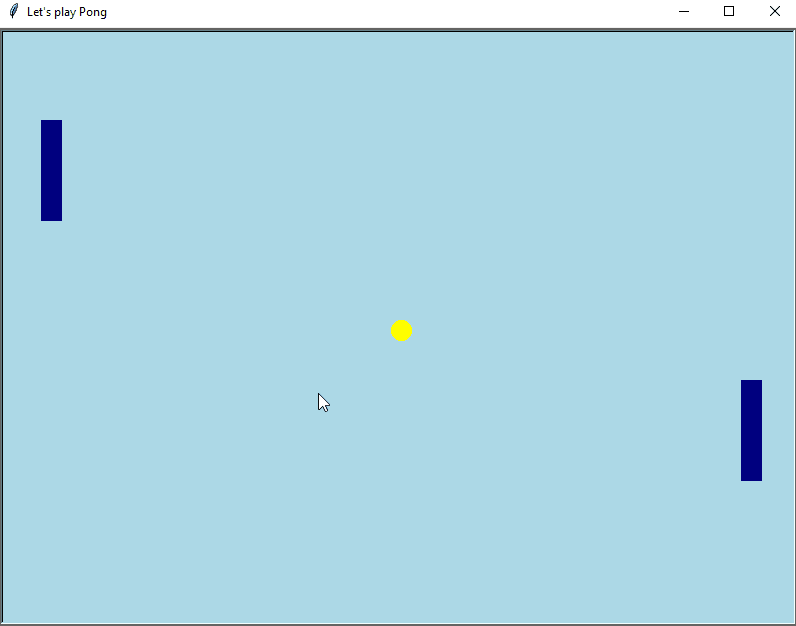

6. Set the ball movement inside the `while loop` to keep the ball animated.  Using the `if` statement to determine when the balls hit the edge of the screen.
When it hits the edge of the screen, the ball will reverse it direction - using the following `ball.dy *= -1`

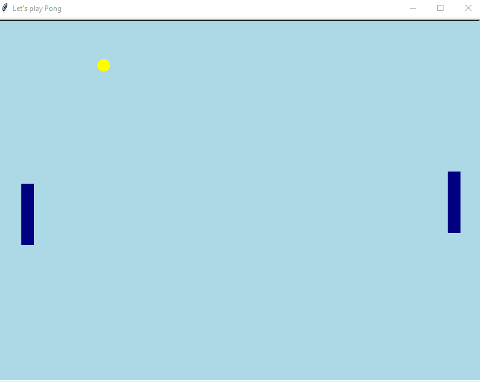

7. Set the screen border limit. If ball goes off the right/left screen, ball will be reset to go in reverse direction. Using the `if` statement condition, I set the X and Y coordinates based on the screen size 800 px wide by 600 px height

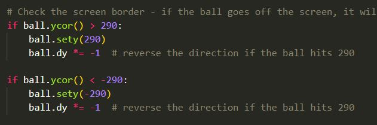

8. Create Display score on center of the screen as players are playing the game. 

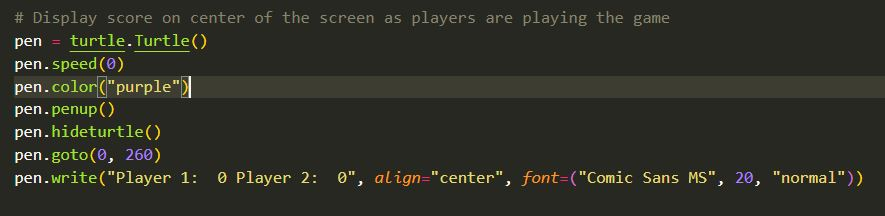

9. Create score for Player A and Player B by assigning `score_a` and `score_b` variable and set them to 0

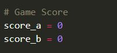

10. Making sure the score board is update, using increment `score_a += 1` in the `if` statement to add point to the player if ball goes off the screen.

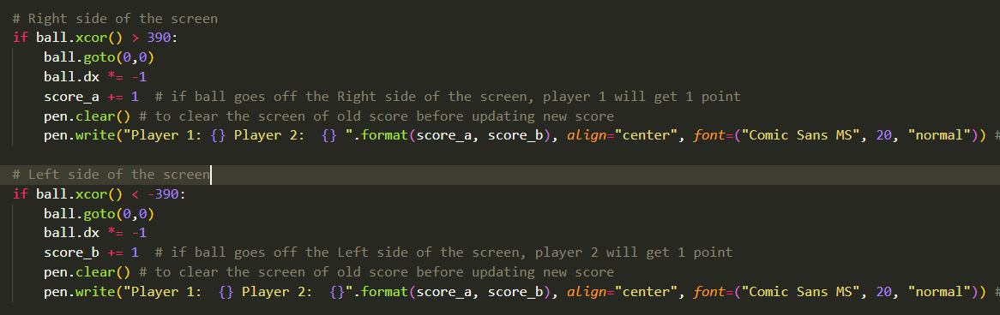

11. Use the `pen.clear()` to clear the score before its updates the score on the scoreboard

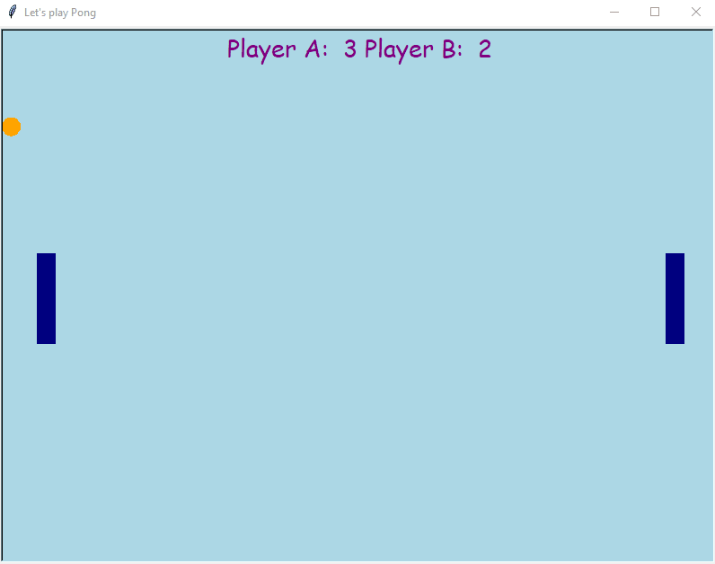

## Problems I encountered:

#### Problem #1:
 * The paddle function does not work. It has this error message when I set the Y coordinates
` line 46, in pad_mov_up pad_mov_up.sety(y) AttributeError: 'function' object has no attribute 'sety'`

#### Solution 1: 
  * In the function calls, make sure the `sety` should have a variable of the Paddle #1

#### Problem #2:
 * Ball does not touch the paddle smoothly. It is a little glitchy.

#### Solution #2: 
 * Reconfigure the `xcor` to be 330 px
