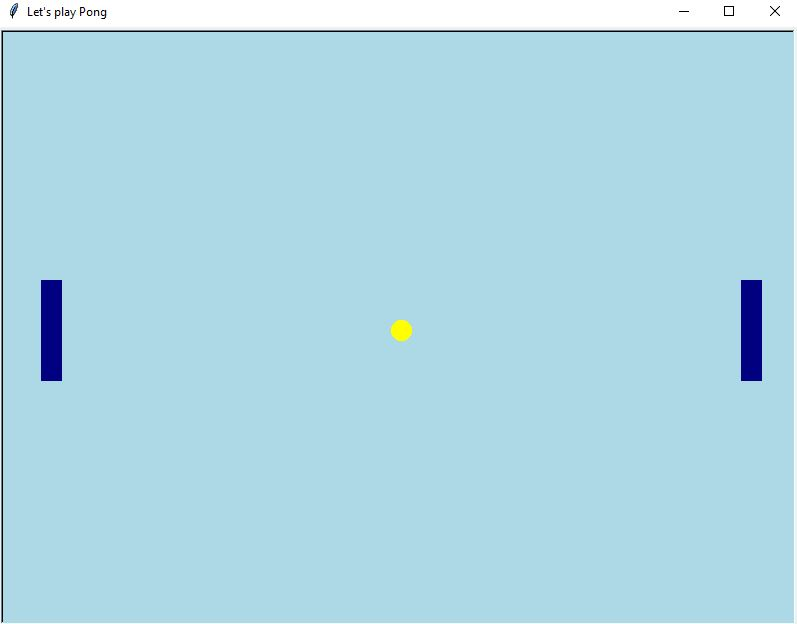

# python-challenge-4
creating a python "Pong" game 

## Step by Step Approach

1. Using Python library `turtle`, I will use it to create a pong game

2. Creating a window screen using by assigning a variable to `turtle.Screen()`

3. I made the background light blue and the paddle navy color and the ball yellow and aligned in the center

4. To make the paddle moving up and down, I created a function call `left_pad_mov_down` and `right_pad_mov_up` using the `w` key and `s` key for the left side and `Up` key and `Down` key for the right side.

5. I created a keyboard binding by using the python `listen()` method and `onkeypress ()` method. The `listen()` allows the computer to listen when the `w` or `s` or `Up` or `Down` keys are pressed by the user.

6. Set the ball movement inside the `while loop` to keep the ball animated.  Using the `if` statement to determine when the balls hit the edge of the screen.
When it hits the edge of the screen, the ball will reverse it direction - using the following `ball.dy *= -1`

##

## Problems I encountered:
1. The paddle function does not work. It has this error message when I set the Y coordinates
` line 46, in pad_mov_up pad_mov_up.sety(y) AttributeError: 'function' object has no attribute 'sety'`

### Solution: 
 In the function calls, make sure the `sety` should have a variable of the Paddle #1

2. Ball does not touch the paddle smoothy. It is a little glitchy.

### Solution: 
 Reconfigure the `xcor` to be 330 px

